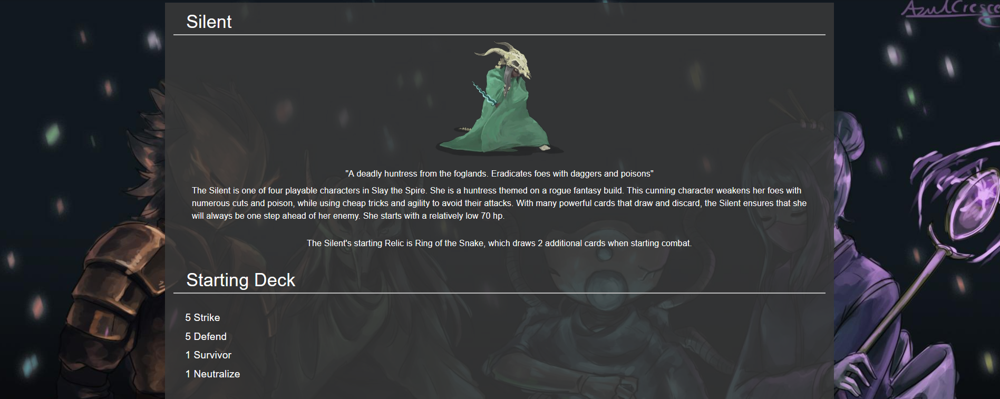
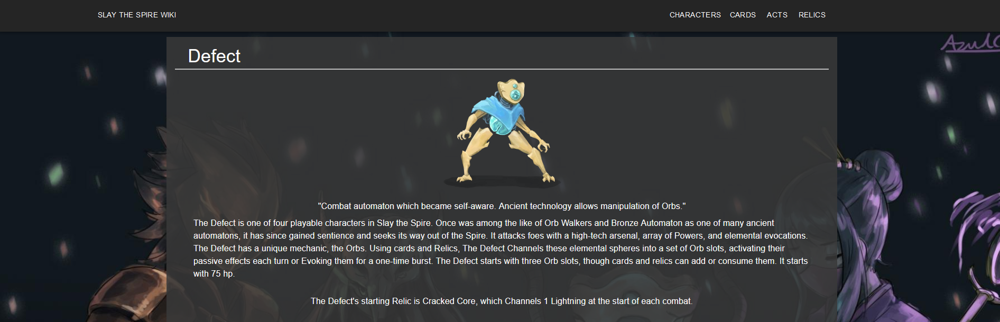

# Slay the Spire wiki

Slay the spire wiki is a fan project built in React/Redux dedicated to informing new players and promoting community growth.

## Visit the project here

[Site Link](https://slay-the-spire-wiki.now.sh/)

## Installation and development

```bash
npm i
npm start
```

## Screenshots




## Contributing
Pull requests are welcome. For major changes, please open an issue first to discuss what you would like to change.

Please make sure to update tests as appropriate.

## License
[MIT](https://choosealicense.com/licenses/mit/)
